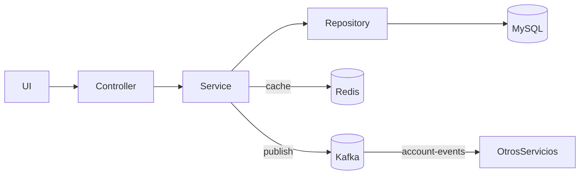

# AccountMS (Final)

Servicio de **Cuentas** con **Kafka**, **Redis**, **Docker**, **MySQL**, **JaCoCo**, **Checkstyle** y **Swagger**.

## Requisitos
- Java 17, Maven 3.9+
- Docker & Docker Compose

## Cómo ejecutar tests, checkstyle y coverage
```bash
mvn clean verify
# coverage: target/site/jacoco/index.html
# checkstyle: target/checkstyle-result.xml (y consola)
```

## Levantar infraestructura + app
```bash
cd docker
docker compose up -d --build
# Swagger: http://localhost:8080/swagger-ui/index.html
```

## Variables (compose)
- MYSQL_ROOT_PASSWORD=root
- SPRING_KAFKA_BOOTSTRAP_SERVERS=kafka:9092
- SPRING_DATA_REDIS_HOST=redis

## Endpoints principales
- `POST /api/v1/accounts`
- `GET /api/v1/accounts/{id}`
- `GET /api/v1/accounts`
- `PUT /api/v1/accounts/{id}`
- `DELETE /api/v1/accounts/{id}`

## Redis (cache)
- Cache `accountById` en `AccountServiceImpl` con `@Cacheable/@CachePut/@CacheEvict`.

## Kafka (eventos)
- Topic `account-events`. Se publica en `create` y `update`.

## Diagrama (Mermaid)


---

© 2025-09-30
