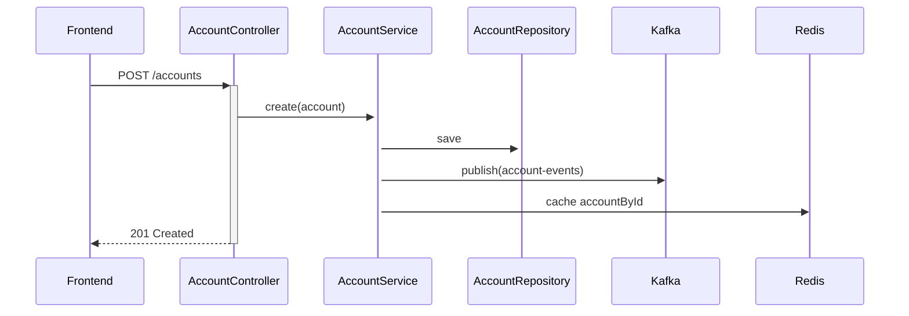

# Diagrams

```mermaid
sequenceDiagram
Frontend->>+AccountController: POST /accounts
AccountController->>+AccountService: create(account)
AccountService->>+AccountRepository: save
AccountService->>Kafka: publish(account-events)
AccountService->>Redis: cache accountById
AccountController-->>-Frontend: 201 Created
```
