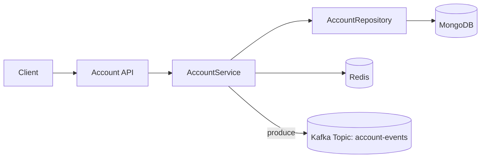
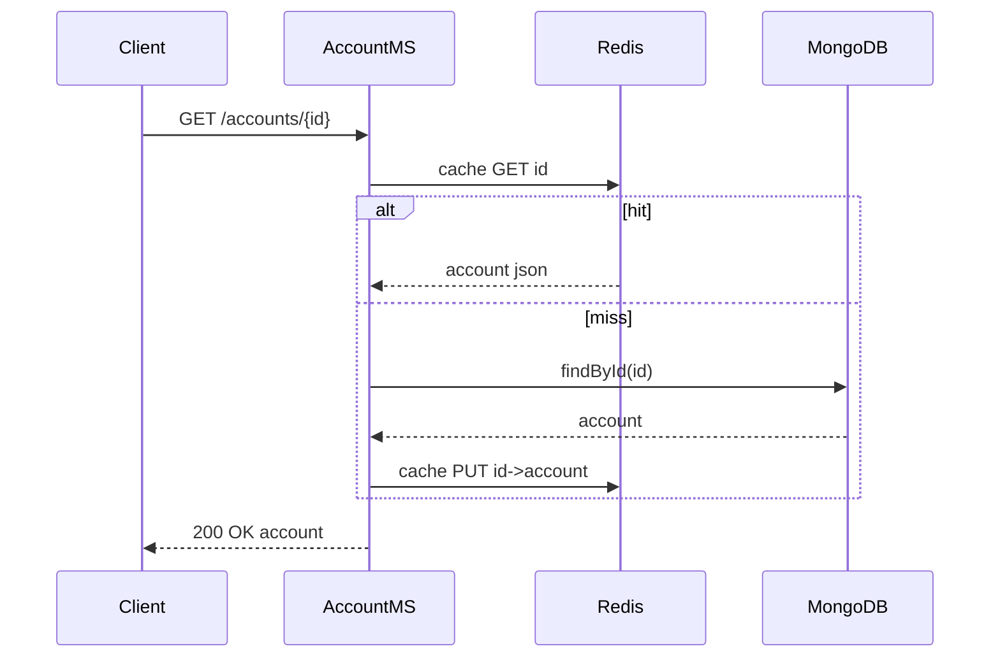

# Diagramas

```mermaid
flowchart LR
  Client-->API[Account API]
  API-->Service[AccountService]
  Service-->Repo[AccountRepository]
  Repo-->DB[(MongoDB)]
  Service-->Cache[(Redis)]
  Service-- produce -->Kafka[(Kafka Topic: account-events)]
```

```mermaid
sequenceDiagram
  participant C as Client
  participant A as AccountMS
  participant R as Redis
  participant M as MongoDB
  C->>A: GET /accounts/{id}
  A->>R: cache GET id
  alt hit
    R-->>A: account json
  else miss
    A->>M: findById(id)
    M-->>A: account
    A->>R: cache PUT id->account
  end
  A-->>C: 200 OK account
```
